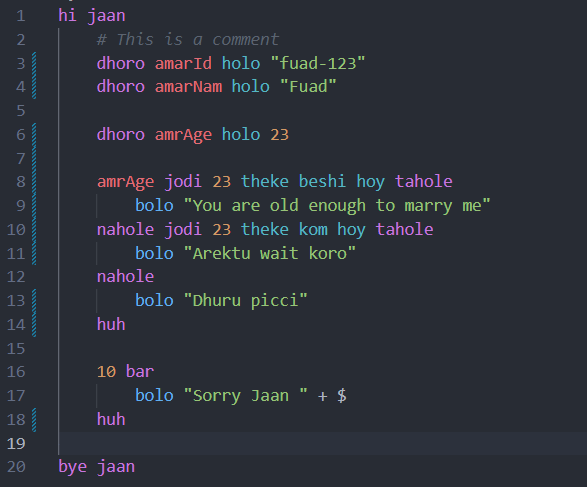

# JaanLang Documentation

JaanLang is a programming language for couples and romantic people. It is a minimal language that anyone can learn very quickly. Enjoy the romantic coding experience!


## Install
Type `npm i -g jaan` in the terminal

## Syntax

### Basic Commands

#### `hi jaan`
Start of the program.

#### `bye jaan`
End of the program.

#### `dhoro`
Declare a variable: `dhoro <variableName>`.

#### `holo`
Assign a value to a variable: `<variableName> holo <value>`.

#### `bolo`
Print statement: `bolo "I love you"`.

#### `huh`
End of any block.

### Conditionals

#### `<variableName> jodi <variableName> <operator> <assertion> tahole`
If statement.

- `<variableName>`: Name of the variable or string or value.
- `<operator>`: Comparison operator (e.g., `er soman`, `er theke beshi`, etc.).
- `<value>`: Value to compare against.
- `<assertion>`: True or false. Can only be `hoy` or `na hoy`

#### `tahole`
Start of the conditional block

### Loops

#### `bar`
Range loop: `10 bar`.
Example: 
```jaan
10 bar
    bolo "I am sorry " + $
```

- `$`: Iteration count variable.
- `<value>`: The upper limit for the loop.

### Comments

#### `#`
Comment: Lines starting with `#` are ignored.

## Example


